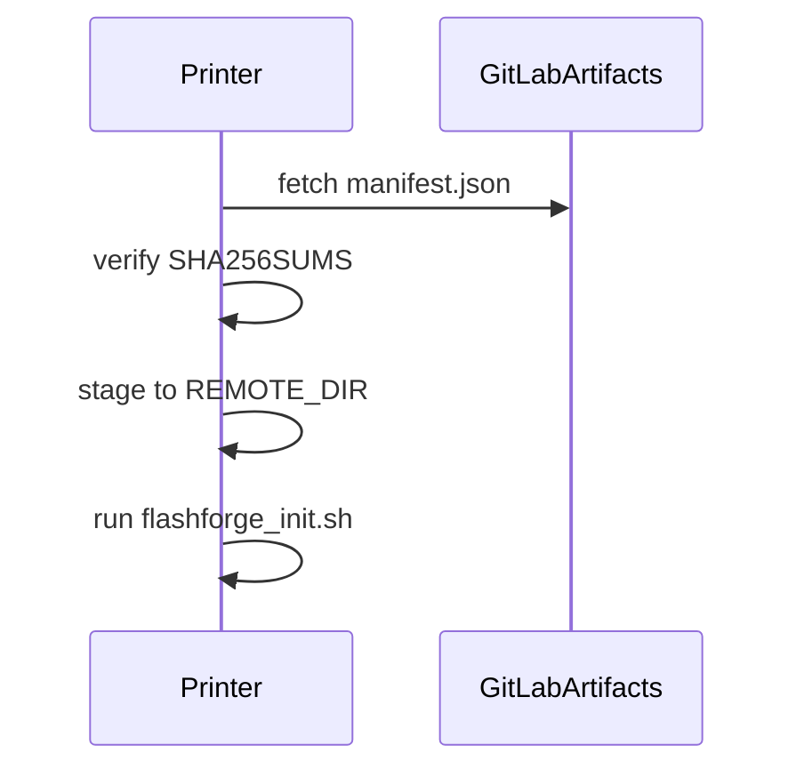

# OTA preview channel (design)

## Status

Design for implementation **after** the SSH dev-deploy loop is validated. Not a production end-user OTA path until safestrap/runtime health gates exist ([ADR 0005](../../docs/specs/adr-0005-runtime-overlay-and-recovery.md)).

## Goals

- Preview testers pull a known build without physical USB re-copy every iteration.
- Artifacts are versioned, checksum-verified, and fail-closed against [support-matrix.md](../../docs/specs/support-matrix.md).
- Same GitLab repository; artifact namespace updates at Kalicoforge rename ([kalicoforge-rename-v0.4.md](../policies/kalicoforge-rename-v0.4.md)).

## CI artifacts

Job `build:n32probe` in [ci/docs-repo.yml](../../ci/docs-repo.yml) publishes:

```text
build/n32probe_usb/
  flashforge_init.sh
  n32probe_{arm,mips}
  fbfill_{arm,mips}
  SHA256SUMS
```

Artifact name pattern:

```text
n32probe-<branch-slug>-<short-sha>
```

Future: GitLab Generic Package registry with the same layout for wget/curl on-printer.

## On-printer updater (sketch)



Planned script location: `support/preview-updater/preview-pull.sh` (not yet implemented).

Environment variables:

| Variable | Purpose |
| --- | --- |
| `PREVIEW_CHANNEL_URL` | Base URL for manifest + artifacts |
| `PREVIEW_ENROLLMENT_TOKEN` | Optional gate (dev/testers only) |
| `REMOTE_DIR` | Staging path (default `/tmp/n32probe_usb`) |

## Gating

1. Printer must be enrolled in preview (token or maintainer allowlist).
2. Manifest includes `platform_group` and `min_firmware` — installer refuses mismatch per [firmware-policy.md](../../docs/specs/firmware-policy.md).
3. Read-only probe remains default; flash-capable payloads require explicit opt-in flag.

## Channels

| Channel | Source branch | Docs banner |
| --- | --- | --- |
| stable | `main` | none |
| preview | `next/firmware-package`, `preview/*` | yes (MkDocs `DOCS_CHANNEL=preview`) |

## Implementation order

1. SSH deploy runbook (done) — [dev-deploy-ssh.md](../runbooks/dev-deploy-ssh.md)
2. CI `build:n32probe` artifacts on preview branches (done in CI config)
3. `preview-pull.sh` + manifest generator in CI
4. Hardware validation on one ADV3 + one ARM profile
5. Document enrollment for Discord preview testers
