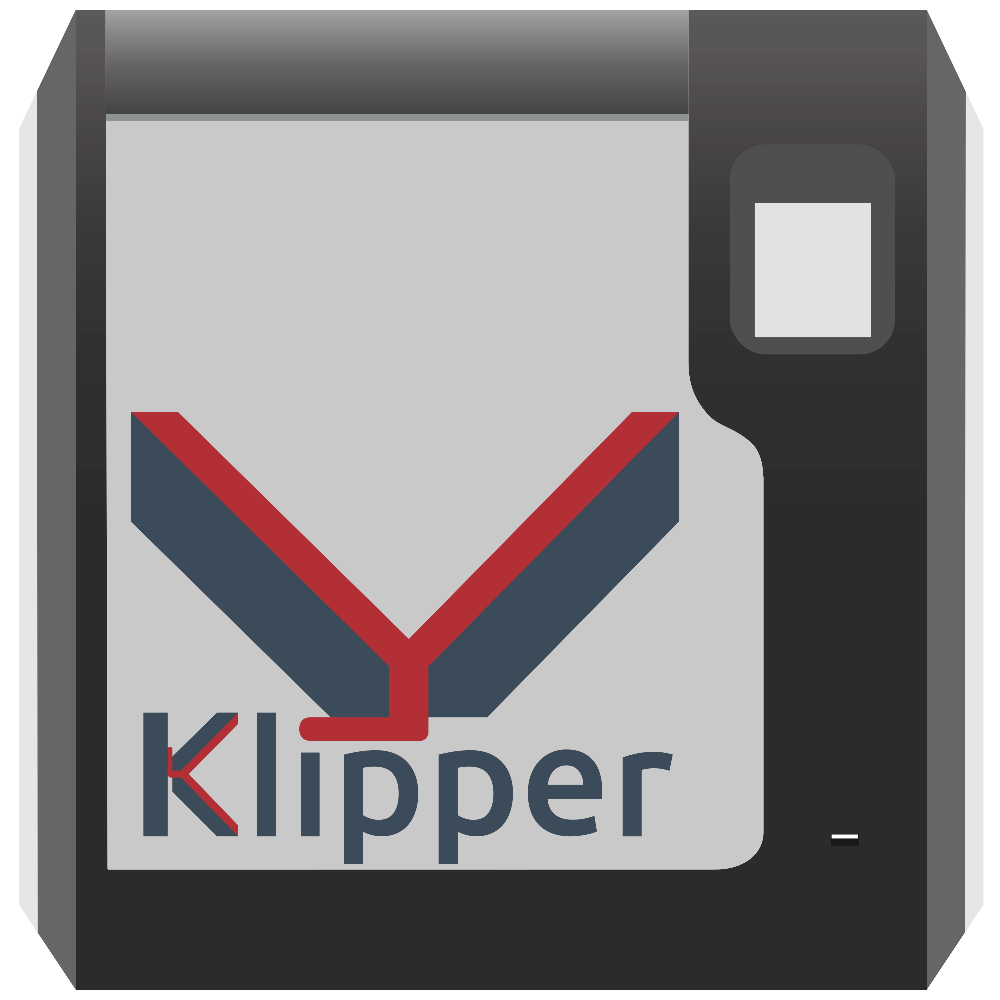

  
  <h1>Klippventurer</h1>
  <h3>Klipperize your FlashForge printer!</h3>
  

  <a href="#compatibility">Compatibility</a> •
  <a href="#installation">Installation</a> •
  <a href="#known-issues">Known Issues</a> •
  <a href="#special-thanks-to">Special Thanks To</a>

## Compatibility

|Printer|Printing|Easy Installer|Pin table|Printer.cfg|Thermistor Calibration|Display|Touch|Filament Runout|Camera|
|---|---|---|---|---|---|---|---|---|---|
|Adventurer 3/Pro*|✅|⏰|✅|✅|⏰|⏰|⏰|⏰|⏰|
|Adventurer 3 Pro 2|❓|⏰|❓|❓|⏰|⚠️|⚠️|⚠️|⚠️|
|Adventurer 4|⚠️|⏰|⚠️|⚠️|⏰|⚠️|⚠️|⚠️|⚠️|
|Adventurer 5M/Pro|✅|⚠️|✅|✅|✅|✅|✅|✅|✅|
|Creator Pro 2|⚠️|⚠️|❓|⚠️|⚠️|⚠️|⚠️|❌|❌|
|Creator 3/Pro |⚠️|⏰|⚠️|⚠️|⚠️|⚠️|⚠️|❌|❌|

✅Working ⠀⠀ ⏰In Progress ⠀⠀ ⚠️Not yet Working ⠀⠀ ❌Not planned or lacks hardware feature ⠀⠀ ❓Untested, might work

>**Note:**
    "Adventurer 3" Includes the Adventurer 3C, Lite, and Pro, as well as rebrands such as the Bresser Rex, Arçelik PT1000, MonoPrice Voxel, and likely any other printer based on the SZ16 mainboard.

## Installation
For installation instructions, please see [the wiki](https://github.com/synthread/Klippventurer/wiki)
#### Always calibrate your Z offset and mesh bed leveling after installing Klipper!!!

This repo, supported features, and guides change often, join our [Discord](https://discord.gg/ns2pFdhdMW) or watch the repo for updates.
Please open an issue or pull request if you encounter any problems with installation.

## Known Issues 
### Adventurer 3 Models
- Nation N32G MCU doesn't work with current .config
- Can't currently support screen, buzzer, USB, filament runout sensor, or camera. This will be solved when the easy installer is released.
- Adventurer 3 Pro works, but you need to modify printer.cfg to use TMC2209 drivers instead of TMC2208.

## Special Thanks To
[@hw-lunemann](https://github.com/hw-lunemann) for fixing UART muxing and tuning input shaper on Adventurer 3

[@kyleisah](https://github.com/kyleisah) and everyone who contributed to [KAMP](https://github.com/kyleisah/Klipper-Adaptive-Meshing-Purging)

[@KevinOConnor](https://github.com/KevinOConnor) and everyone who contributed to [Klipper](https://github.com/Klipper3d/klipper)

[@FlashforgeOfficial](https://github.com/FlashforgeOfficial) for good hardware at a fair price
