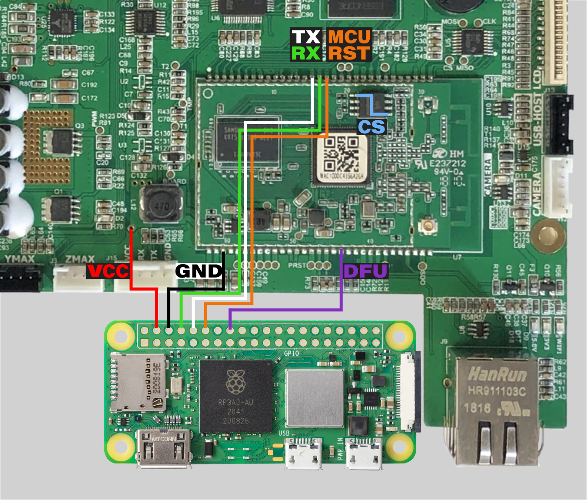

# Installation ADV3

> [!CAUTION]
> You should be familiar with installing and configuring Klipper before attempting this.
> You are solely responsible for any damage caused by following any part of this guide.

> [!WARNING]
> This guide will soon be deprecated as this install method is considered to be in an ALPHA testing state.
> Public testing for the BETA install method will be beginning soon, join our Discord to keep up to date with announcements.

> [!WARNING]
> CHECK your microcontroller brand before attempting this. It will only work on STM32, HK32, and GD32 MCUs.
> Nation N32 MCUs are not supported by this guide as they need to be programmed via a slightly different method.

> [!NOTE]
> This Guide was written with [Raspberry Pi Imager v2.0.2](https://github.com/raspberrypi/rpi-imager/releases/tag/v2.0.2) and Raspbian GNU/Linux 12 (bookworm) armv7l on a [Raspberry Pi Zero 2 W Rev 1.0](https://www.raspberrypi.com/products/raspberry-pi-zero-2-w/) with Linux 6.12.47+rpt-rpi-v7

## Requirements

+ very basic soldering skills
+ a soldering iron with temperature control
+ solder (preferably SnPb or SnBi solder, SnAg is harder to work with)
+ A [Raspberry Pi Zero 2 W](https://www.raspberrypi.com/products/raspberry-pi-zero-2-w/) (or any other Pi you'll just need to select it in the Raspberry Pi Imager)
+ SD card (at least 4GB, 16GB or larger recommended)
+ insulated silicone wire, multiple colors preferred (silicone insulation won't melt during soldering)
+ 4x M2.5x4 screws
+ 4x M2.5 threaded heat-set inserts
+ Raspberry Pi Zero mount from the [STLs](/STLs/) folder

### Recommended

+ Extruder tensioning spacer from the [STLs](/STLs/) folder
+ paste or liquid flux
+ cotton swabs and or cotton pads (something to clean the board with)
+ IPA or PCB cleaner

## Part 1 - Get Connected 🔌

> [!IMPORTANT]
> Don't work inside the printer with the power cable connected

Step 1: Print the Pi mount and (optional) extruder spacer from the [STLs](/STLs/) folder. The Pi mount is designed to be printable on Adventurer 3 without support material. PLA may not work due to the temperature of the electronics enclosure, HTPLA or higher glass transition filament (PETG, ABS, etc.) recommended.
Insert the 4 threaded inserts into the Pi mount using your soldering iron with a conical tip or threaded insert tip.

Optional Step: With the printer unplugged, use a hex 2.5 bit or Allen key to remove the tensioning arm from the extruder assembly behind the filament hatch. Be careful not to drop the spring into the housing of the printer, it's much less work if you don't have to fish the spring out. Install the spacer onto the spring retention peg. Reassemble the extruder. Video demonstration here: https://www.youtube.com/shorts/PZRefwOkk9g
This will improve the maximum flow rate significantly, and coupled with the increased extruder motor torque in Klipper, massively reduces or eliminates the clicking extruder issue.

Step 2: Unplug your printer. Carefully turn the printer upside down on a soft surface so as to not scratch the top acrylic panel.
Remove the 4 screws securing the metal electronics cover.
You may choose to remove the board from the printer and place it on your work surface to make soldering easier.
If you do, you'll need to remove the glue covering the MHF micro-coax Wi-Fi antenna cable, unplug all connectors, and remove all 4 screws securing the board.

Step 3: Locate the pads in the diagram ([Wiring-diagram.png](../images/adv3-diagram.png)), apply flux, then tin the pads.



Step 4: Solder your wires to the pads as indicated. Make sure all wires are long enough to connect to your Pi, about 10cm or 4in. Strip both ends before soldering to make your life easier later (about 2mm on each end)
You should connect the following to your printer's mainboard:
+ one wire to TX (white)
+ one wire to RX (green)
+ one wire to MCU RST (orange)
+ one wire to DFU (purple)
+ one wire to VCC (red)
+ one wire to GND (black)
+ bridge CS (blue)

## Part 2 - Prepare The Pi 🪛

Step 1: Download the latest [Raspberry Pi Imager](https://www.raspberrypi.com/software/) Under "Raspberry Pi Device" select "Raspberry Pi Zero 2 W" (or your Pi). For Operating System, go to "Raspberry Pi OS (other)" and select "Raspberry Pi OS (Legacy, 32-bit) Lite", choose your SD card, then hit next. Complete Customisation (like selecting your hostname). Under "Remote Access" enable SSH and select "Use password authentication" (unless you know what you're doing). Save, then click "Write" and "I UNDERSTAND, ERASE AND WRITE" when it asks if you're sure you want to continue. Once done writing the SD, remove it and insert it into the Pi.

Step 2: If you removed the mainboard to solder your wires, reinstall it now, but leave out the 2 screws closest to the power socket. If you left the board in, go ahead and remove those 2 screws now. Place your Pi mounting bracket on the mainboard with the two legs aligned with the holes in the mainboard. Insert the two mainboard screws through the bracket and mainboard to secure them both. Using the 4 M2.5 screws, secure the Pi to the mounting bracket.

Step 3: Time to test! Plug the printer back into power, and flip the switch on. The printer **should not** boot up. Screen should remain black, mainboard LEDs should come on, the Pi should power up, and nothing else should happen. If the printer does boot normally into the stock firmware, make sure the CS bridge is in place and works. If all works, now is the time to clean the flux off the board with your cleaner and cotton swabs.

## Part 3 - Klipper, Mainsail, Fluidd, Orca Slicer! ⛵💧🐋

Step 1: SSH into your Pi. You'll need to find the IP in your router's config page or app.

Run the following commands:

```sh
echo -e "enable_uart=1\ndtoverlay=miniuart-bt\ndtoverlay=disable-bt" | sudo tee -a /boot/firmware/config.txt
sudo sed -i 's/console=serial0,115200 //' /boot/firmware/cmdline.txt
sudo apt update && sudo apt install stm32flash git -y
cd ~ && git clone https://github.com/dw-0/kiauh.git
git clone https://gitlab.com/synthread/3d/Klippventurer.git
./kiauh/kiauh.sh
```

Once at the KIAUH menu, install 1) Klipper, 2) Moonraker, and 4) Fluidd. You can also install Mobileraker (under Extensions) for mobile push notifications via the [Mobileraker app](https://mobileraker.com/).
Exit KIAUH with B then Q and do

```sh
cp -r ~/Klippventurer/config/ ~/printer_data/
wget -O ~/klipper/.config https://gitlab.com/synthread/3d/Klippventurer-Installer/-/raw/main/configs/adventurer3.config
cd ~/klipper && make menuconfig
```

press Q followed by Y. Now

```sh
make
```

and if the build completes without errors,

```sh
sudo reboot
```

Wait for the Pi to reboot, SSH back in and run

```sh
sudo stm32flash -w ~/klipper/out/klipper.bin -R -i -530,535,530:-530,-535,530 /dev/ttyAMA0
```

A successful flash should look something like this:

```sh
stm32flash 0.7

http://stm32flash.sourceforge.net/

Using Parser : Raw BINARY
Size         : 38368
Interface serial_posix: 57600 8E1

GPIO sequence start
 setting gpio 530 to 0... OK
 delay 100000 us
 setting gpio 535 to 1... OK
 delay 100000 us
 setting gpio 530 to 1... OK
GPIO sequence end

Version      : 0x10
Option 1     : 0x00
Option 2     : 0x00
Device ID    : 0x0414 (STM32F10xxx High-density)
- RAM        : Up to 64KiB  (512b reserved by bootloader)
- Flash      : Up to 512KiB (size first sector: 2x2048)
- Option RAM : 16b
- System RAM : 2KiB
Write to memory
Erasing memory
Wrote address 0x080095e0 (100.00%) Done.

Resetting device...

GPIO sequence start
 setting gpio 530 to 0... OK
 delay 100000 us
 setting gpio 535 to 0... OK
 delay 100000 us
 setting gpio 530 to 1... OK
GPIO sequence end

Reset done.
```

You should now be able to access the Fluidd interface from your browser or Orca Slicer. If you don't get an error (warnings are fine), go ahead and unplug the printer and reinstall the bottom cover. You may need to try restarting the firmware.

Set it back right-side-up and power it on. Reconnect to Fluidd, cross your fingers, and hit the home button!

Calibrate your Z offset and make a bed mesh and also probably an [PID calibration](https://www.klipper3d.org/Config_checks.html#calibrate-pid-settings)!
